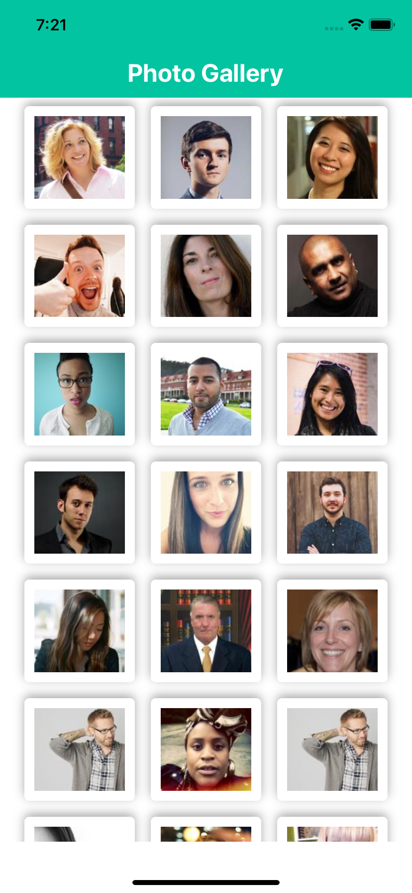
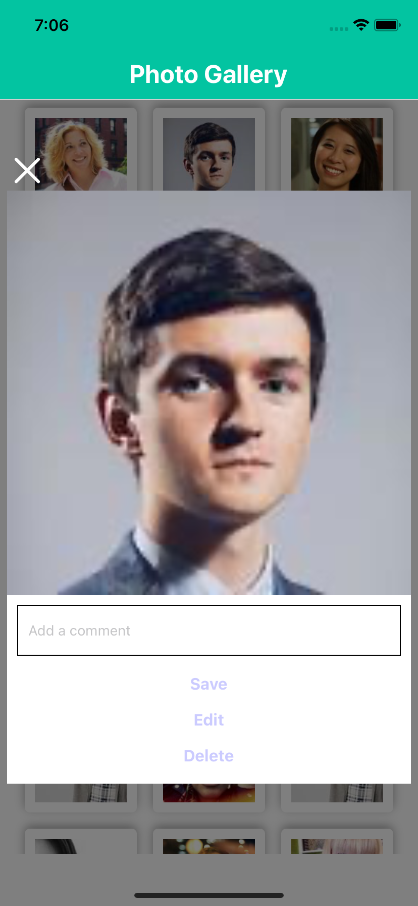
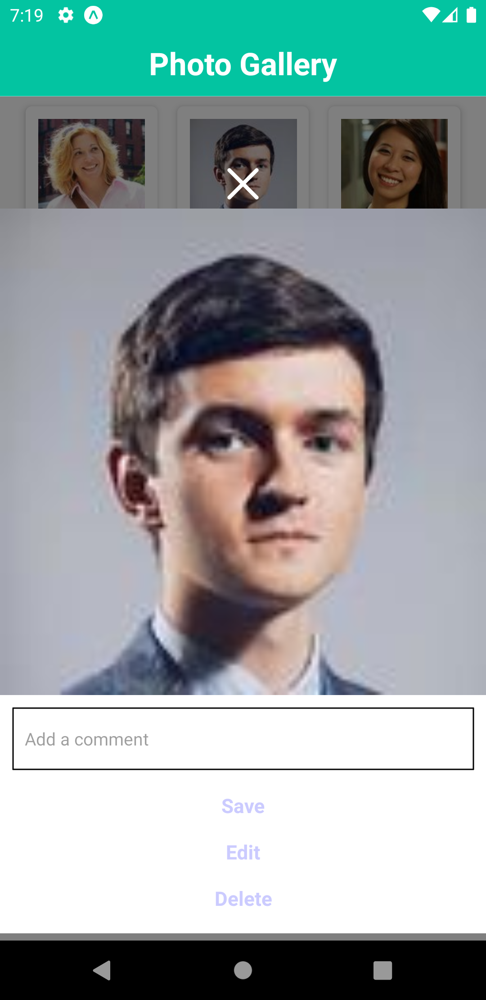
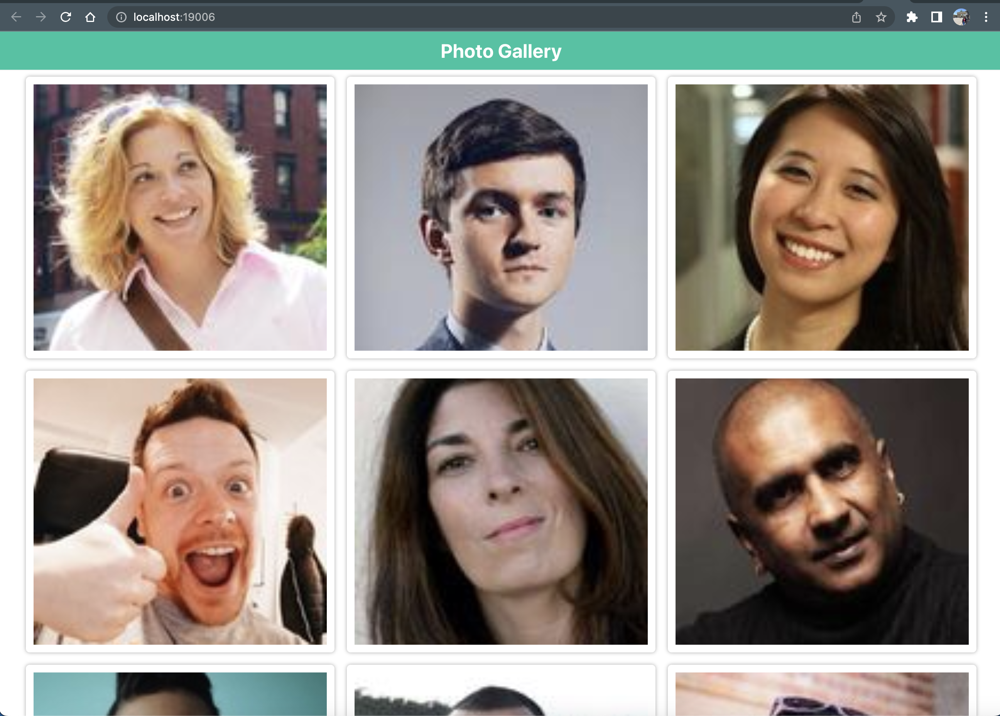
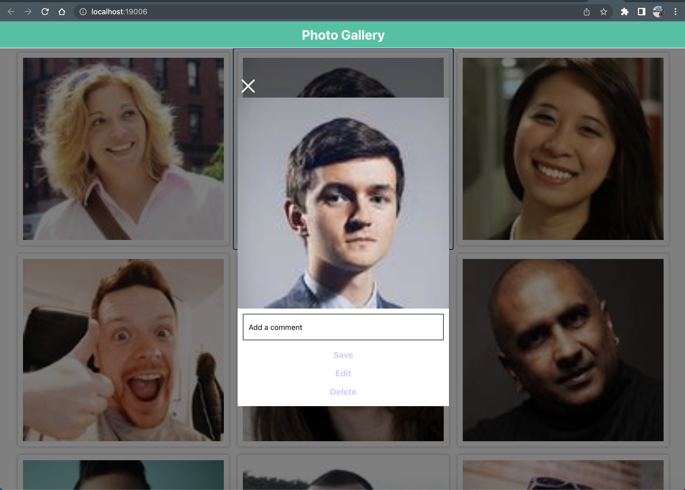

# PhotoGallery


# Photo Gallery App
The aim of this exercise is to create a responsive photo gallery application using React Native and following toolset.
- redux-toolkit + react-query(used RTK Query)
- hooks
- styled-components
- typescript
- mocked images from [randam user generator](https://randomuser.me/)


# See [Getting Started](https://reactnative.dev/docs/environment-setup) to install requirement tools.


clone the repository and follow the installation and development steps to run the app.


# Installation steps

```bash
$ yarn install
```


# Development

 Run below commands to open Android/ios/web simulator and run app:

```bash
$ yarn ios
```
```bash
$ yarn android
```
```bash
$ yarn web
```


# Screenshots of the app on various platform
- ios

<p float="left">
  
  
</p>

- android

<p float="left"> 
  
  
 </p>
 
- web

 <p float="left">
  
  
</p>


